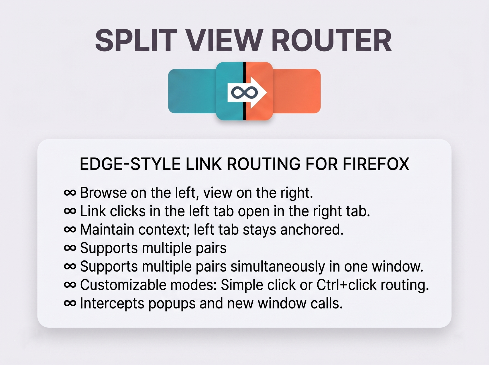
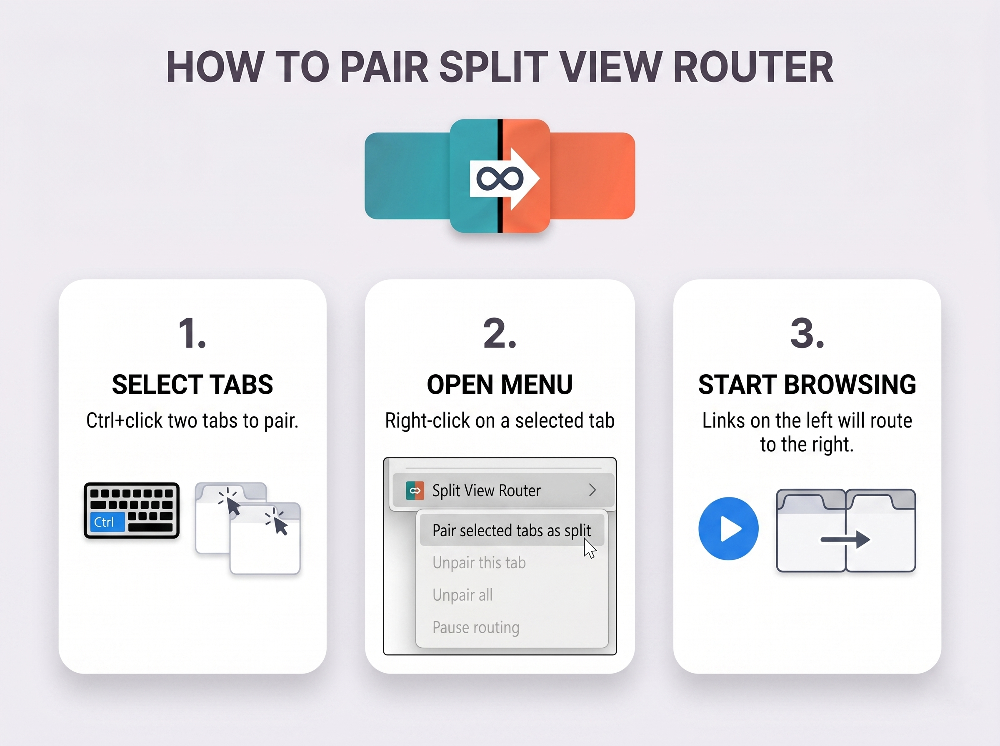
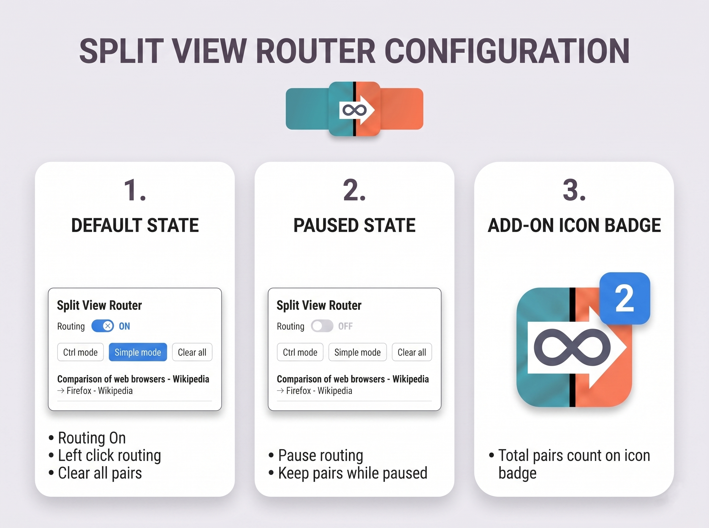
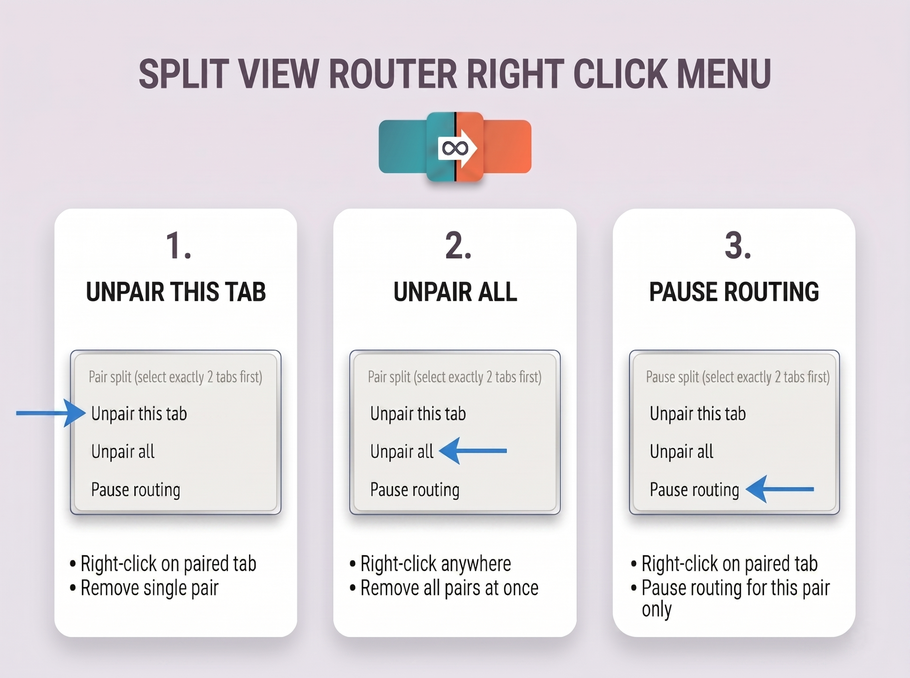

# Split View Router

[](https://github.com/neuralrift/split-view-router-firefox/releases/tag/v1.1.0)
[](https://addons.mozilla.org/en-US/firefox/addon/split-view-router/)
[](LICENSE)
[](PRIVACY.md)

Edge-style link routing for Firefox's built-in split tab view.

Split View Router lets you pair two Firefox tabs, then route link clicks from the left tab into the right tab. Keep a search page, issue list, documentation index, or inbox anchored on the left while opening each result in the companion tab on the right.

[](https://addons.mozilla.org/en-US/firefox/addon/split-view-router/)

## Install

**Recommended: install from Mozilla Add-ons**

[Get Split View Router on AMO](https://addons.mozilla.org/en-US/firefox/addon/split-view-router/)

**Install the signed XPI from GitHub Releases**

1. Download `split_view_router-1.1.0-signed.xpi` from the [v1.1.0 release](https://github.com/neuralrift/split-view-router-firefox/releases/tag/v1.1.0).
2. Open the downloaded `.xpi` in Firefox, or drag it onto a Firefox window.
3. Confirm the installation prompt.

**Load manually for development**

1. Clone this repository.
2. Open Firefox and go to `about:debugging#/runtime/this-firefox`.
3. Choose **Load Temporary Add-on...**.
4. Select this repository's `manifest.json`.

Temporary installs are unsigned, development-only, and are removed when Firefox restarts.

## Feature Highlights

| Capability | What it does |
| :--- | :--- |
| Left-to-right routing | Plain link clicks in the left paired tab can open in the right paired tab. |
| Firefox split-view workflow | Designed for Firefox's native **Split Tab** experience. |
| Multiple pairs | Run more than one independent left/right pair in the same Firefox session. |
| Two routing modes | **Simple mode** routes normal clicks. **Ctrl mode** routes only Ctrl-click or Cmd-click. |
| Per-pair pause | Pause or resume routing for a specific pair from the tab context menu. |
| Global routing switch | Turn all routing on or off from the toolbar popup. |
| Session restore | Pairs and pause state are rebuilt after Firefox restores a previous browser session. |
| Popup and badge | See active pairs, current mode, and routing state from the toolbar. |
| `target="_blank"` support | Routes regular links, new-tab links, and supported `window.open()` flows. |
| Diagnostics | Copy extension state and recent debug events from the add-on preferences page. |
| Privacy-first | No analytics, no remote service, no account, and no data collection. |

## Screenshots

| Pair tabs | Manage routing | Use the tab menu |
| :--- | :--- | :--- |
|  |  |  |

## Usage

1. Open two tabs you want to use as a split pair.
2. Use Firefox's native **Split Tab** action to place them side by side.
3. Select both tabs in the tab strip. In Firefox, use Ctrl-click on Windows/Linux or Cmd-click on macOS.
4. Right-click one of the selected tabs and choose **Pair selected tabs as split**.
5. Click links in the left tab. The routed destination opens in the right tab.

### Routing Modes

| Mode | Behavior |
| :--- | :--- |
| Simple | Normal left-click routes to the right tab. Ctrl-click or Cmd-click keeps Firefox's normal new-tab behavior. |
| Ctrl | Ctrl-click or Cmd-click routes to the right tab. Normal left-click stays in the left tab. |

Change modes from the toolbar popup, or assign a shortcut in `about:addons` under **Manage Extension Shortcuts**.

### Context Menu Actions

Right-click a tab to access the add-on actions:

- **Pair selected tabs as split** creates a left/right pair from exactly two highlighted tabs.
- **Unpair this tab** removes the pair that contains the current tab.
- **Unpair all** clears every pair.
- **Pause routing** and **Resume routing** control routing for one pair without deleting it.

## Privacy and Permissions

Split View Router runs locally inside Firefox and does not collect, transmit, sell, or share user data. See [PRIVACY.md](PRIVACY.md) for the full privacy statement.

| Permission | Why it is needed |
| :--- | :--- |
| `tabs` | Track paired tabs, update the right tab, and clean up pairs when tabs close. |
| `storage` | Save routing mode, pair state, pause state, and local diagnostics. |
| `sessions` | Restore pair metadata after Firefox restores a previous session. |
| `contextMenus` | Add Pair, Unpair, Pause, and Resume actions to the tab context menu. |
| `<all_urls>` | Intercept clicks on pages that are part of a user-created pair. |

## Compatibility

- Firefox 149 or newer is required by the signed add-on.
- Firefox's native split tab feature must be available in the browser.
- Internal Firefox pages such as `about:newtab`, `about:addons`, and `about:debugging` do not run content scripts, so routing is not available inside those pages.
- Some strict Content Security Policy pages may block the `window.open()` override. Regular anchor links still route where Firefox allows the content script to run.

## Development

```bash
npm install
npm test
npm run lint
npm run build
```

Useful commands:

| Command | Purpose |
| :--- | :--- |
| `npm test` | Run the Vitest unit suite. |
| `npm run test:e2e` | Run the Playwright smoke test. |
| `npm run lint` | Validate the extension with `web-ext lint`. |
| `npm run build` | Create an unsigned package in `web-ext-artifacts/`. |
| `npm run start` | Launch Firefox with the extension loaded by `web-ext`. |

## Release Notes

Current release: [v1.1.0](https://github.com/neuralrift/split-view-router-firefox/releases/tag/v1.1.0)

See [CHANGELOG.md](CHANGELOG.md) for version history.

## License

[MIT](LICENSE)
